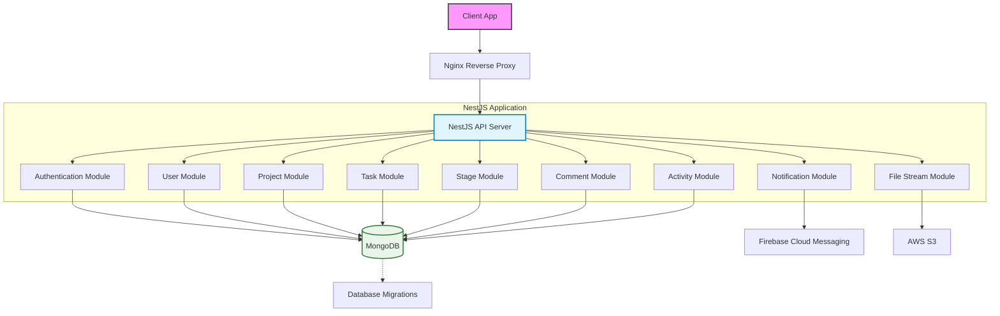

# Architecture Documentation

## 1. High-Level Overview

### 1.1 Application Type

- **NestJS Backend**: A robust, scalable backend API for a bug tracking and project management application.
- **Tech Stack**:
  - **Runtime**: Node.js
  - **Framework**: NestJS
  - **Database**: MongoDB (via Mongoose)
  - **File Storage**: AWS S3
  - **Notifications**: Firebase Cloud Messaging (FCM)
  - **Authentication**: JWT (Access & Refresh), OAuth (Google)

### 1.2 Architectural Pattern

The application follows a **Modular Monolith** architecture using **NestJS**. It adheres to the **Controller-Service-Repository** pattern for clean separation of concerns:

- **Controller**: Handles HTTP requests and responses.
- **Service**: Contains business logic.
- **Repository**: Handles data access and database interactions.

## 2. System Architecture Diagram

The following diagram illustrates the high-level components and their interactions.



## 3. Core Modules & Components

### 3.1 Main Entry Point

- **File**: `src/main.ts`
- **Responsibilities**:
  - Bootstraps the NestJS application.
  - Configures global middleware (CORS, Helmet, Validation Pipe).
  - Sets up exception filters.
  - Initializes Swagger documentation.
  - Initializes Firebase Admin SDK.

### 3.2 Configuration

- **Directory**: `src/config/`
- **Key Files**:
  - `firebase.config.ts`: Firebase Admin SDK initialization.
  - `swagger.config.ts`: Swagger/OpenAPI documentation setup.

### 3.3 Database Layer

- **Technology**: MongoDB with Mongoose.
- **Configuration**: `src/common/database/`
- **Pattern**: Abstract Repository (`DatabaseMongoRepositoryAbstract`) provides a consistent interface for data access across all entities.

### 3.4 Feature Modules

1.  **Authentication Module** (`src/modules/auth/`):
    - Handles login, signup, JWT generation, and OAuth.
    - Guards: `JwtAuthGuard`, `RolePermissionGuard`.
2.  **User Module** (`src/modules/user/`):
    - Manages user profiles and data.
3.  **Project Module** (`src/modules/project/`):
    - Manages projects, members, and project-specific settings.
4.  **Task Module** (`src/modules/task/`):
    - Core issue/bug tracking logic with status and priority enums.
5.  **Stage Module** (`src/modules/stage/`):
    - Manages Kanban board stages.
6.  **Comment Module** (`src/modules/comment/`):
    - Handles comments on tasks/projects.
7.  **Activity Module** (`src/modules/activity/`):
    - Audit logging for changes.
8.  **Notification Module** (`src/modules/notification/`):
    - Real-time notifications via Firebase.
9.  **File Stream Module** (`src/modules/file-stream/`):
    - Handles file uploads to AWS S3.

### 3.5 Shared Modules

- **Common Modules**: `src/common/`
  - Database, AWS, Logger, HTTP Interceptors.

## 4. Data Flow Process

### 4.1 HTTP Request Flow (Standard CRUD)

1.  **Client** sends HTTP Request (e.g., `POST /api/v1/project`).
2.  **NestJS Global Middleware** processes the request (CORS, Helmet, Logging).
3.  **Controller** receives the request, validates DTOs using `class-validator`.
4.  **Service** executes business logic (validation, data processing).
5.  **Repository** interacts with the database (MongoDB).
6.  **Service** receives data from the repository.
7.  **Controller** formats the response and sends it back to the client.

### 4.2 Authentication Flow (JWT)

1.  **User** sends credentials (email/password) to `/authentication/sign-in`.
2.  **Auth Controller** validates credentials.
3.  **Auth Service** verifies password hash.
4.  **Auth Service** generates Access Token (short-lived) and Refresh Token (long-lived).
5.  **Tokens** are returned to the client.
6.  **Client** stores tokens (typically in HTTP-only cookies or local storage).
7.  **Subsequent Requests** include the Access Token in the `Authorization` header.
8.  **JwtAuthGuard** validates the token on protected routes.

### 4.3 Real-time Notification Flow

1.  **Event Trigger** (e.g., Task assigned).
2.  **Service** calls `NotificationService`.
3.  **NotificationService** formats the message.
4.  **Firebase Admin SDK** sends push notification to the user's device token.
5.  **Client App** receives the notification via FCM listener.

## 5. Database Schema (MongoDB)

### 5.1 Entity Relationships

- **User**: Referenced by `createdBy`, `updatedBy`, `assignee`, `reporter` in other entities.
- **Project**: Contains `Stage`s and `Task`s.
- **Stage**: Belongs to a `Project`, contains `Task`s.
- **Task**: Belongs to a `Stage` and `Project`, has `Comment`s and `Activity` logs.

### 5.2 Key Schemas

- **User Entity** (`user.entity.ts`): Fields include `firstName`, `lastName`, `email`, `password`, `picture`.
- **Project Entity** (`project.entity.ts`): Fields include `name`, `description`, `shortId`.
- **Task Entity** (`task.entity.ts`): Fields include `title`, `detail`, `status` (Enum), `priority` (Enum), `dueDate`.
- **Stage Entity** (`stage.entity.ts`): Fields include `name`, `order`.

## 6. Security & Authentication

### 6.1 Authentication Strategy

- **JWT**: Stateless authentication using access and refresh tokens.
- **OAuth**: Google provider integration.

### 6.2 Authorization

- **RBAC (Role-Based Access Control)**: Implemented via `@RolePermission` decorator and `RolePermissionGuard`.
- **Permissions**: Stored in `Permission` entity, associated with `Role`s.

### 6.3 Security Middleware

- **Helmet**: Sets secure HTTP headers.
- **CORS**: Configured to allow specific origins.
- **Validation**: `class-validator` ensures input data integrity.
- **Guards**: `JwtAuthGuard`, `RolePermissionGuard` protect routes.

## 7. API Documentation

### 7.1 Swagger Integration

- **Endpoint**: `/swagger`
- **Generated From**: `@nestjs/swagger` decorators on controllers and DTOs.
- **Authentication**: Supports Bearer token authentication for testing protected endpoints.

### 7.2 Key Endpoints

- `POST /api/v1/authentication/sign-in`
- `POST /api/v1/project`
- `GET /api/v1/project/{shortId}`
- `POST /api/v1/project/{projectShortId}/stage/{stageShortId}/task`

## 8. Deployment & Infrastructure

### 8.1 Dockerization

- **Dockerfile**: Multi-stage build for production.
- **Docker Compose**: Defines services (API, MongoDB, etc.).

### 8.2 Environment Variables

- Critical configuration managed via `.env` file (not committed to repo).
- Includes database URI, JWT secrets, AWS credentials, Firebase config.

## 9. Code Structure Summary

```
src/
├── main.ts                 # Application entry point
├── app.module.ts           # Root module
├── config/                 # Configuration files
├── common/                 # Shared modules (database, aws, logger, etc.)
├── modules/
│   ├── auth/               # Authentication logic
│   ├── user/               # User management
│   ├── project/            # Project management
│   ├── task/               # Task/Issue tracking
│   ├── stage/              # Kanban stages
│   ├── comment/            # Comments system
│   ├── activity/           # Activity logging
│   ├── notification/       # Notifications
│   └── file-stream/        # File uploads
```
