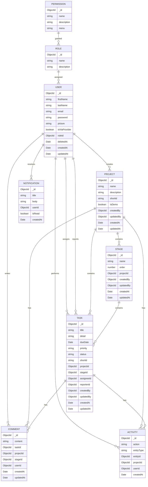

# Database Schema Documentation

## 1. Database Technology

- **Type**: MongoDB (NoSQL)
- **ODM**: Mongoose
- **Connection**: Managed via `src/common/database/`

## 2. Entity Relationship Diagram



## 3. Detailed Schema Definitions

### 3.1 User Entity

**File**: `src/modules/user/entities/user.entity.ts`

| Field           | Type     | Required | Description                  |
| --------------- | -------- | -------- | ---------------------------- |
| `_id`           | ObjectId | Auto     | Primary key                  |
| `firstName`     | String   | Yes      | User's first name            |
| `lastName`      | String   | Yes      | User's last name             |
| `email`         | String   | Yes      | Unique email address         |
| `password`      | String   | Yes      | Hashed password              |
| `picture`       | String   | No       | Profile picture URL          |
| `isViaProvider` | Boolean  | No       | True if registered via OAuth |
| `roleId`        | ObjectId | No       | Reference to Role            |
| `deletedAt`     | Date     | No       | Soft delete timestamp        |
| `createdAt`     | Date     | Auto     | Creation timestamp           |
| `updatedAt`     | Date     | Auto     | Update timestamp             |

**Indexes**:

- `email`: Unique index
- `roleId`: Foreign key index

### 3.2 Project Entity

**File**: `src/modules/project/schema/project.entity.ts`

| Field         | Type     | Required | Description             |
| ------------- | -------- | -------- | ----------------------- |
| `_id`         | ObjectId | Auto     | Primary key             |
| `name`        | String   | Yes      | Project name            |
| `description` | String   | No       | Project description     |
| `shortId`     | String   | Yes      | Unique short identifier |
| `isDemo`      | Boolean  | No       | Demo project flag       |
| `createdBy`   | ObjectId | Yes      | Reference to User       |
| `updatedBy`   | ObjectId | No       | Reference to User       |
| `createdAt`   | Date     | Auto     | Creation timestamp      |
| `updatedAt`   | Date     | Auto     | Update timestamp        |

**Indexes**:

- `shortId`: Unique index
- `createdBy`: Foreign key index

### 3.3 Task Entity

**File**: `src/modules/task/entities/task.entity.ts`

| Field        | Type     | Required | Description                                                     |
| ------------ | -------- | -------- | --------------------------------------------------------------- |
| `_id`        | ObjectId | Auto     | Primary key                                                     |
| `title`      | String   | Yes      | Task title                                                      |
| `detail`     | String   | No       | Task description                                                |
| `dueDate`    | Date     | No       | Deadline                                                        |
| `priority`   | Enum     | Yes      | LOW, NORMAL, HIGH, CRITICAL                                     |
| `status`     | Enum     | Yes      | OPEN, IN_PROGRESS, READY_FOR_TEST, REVIEW, FAILED, CLOSED, HOLD |
| `shortId`    | String   | Yes      | Unique short identifier                                         |
| `projectId`  | ObjectId | Yes      | Reference to Project                                            |
| `stageId`    | ObjectId | Yes      | Reference to Stage                                              |
| `assigneeId` | ObjectId | No       | Reference to User (assignee)                                    |
| `reporterId` | ObjectId | Yes      | Reference to User (reporter)                                    |
| `createdBy`  | ObjectId | Yes      | Reference to User                                               |
| `updatedBy`  | ObjectId | No       | Reference to User                                               |
| `createdAt`  | Date     | Auto     | Creation timestamp                                              |
| `updatedAt`  | Date     | Auto     | Update timestamp                                                |

**Indexes**:

- `shortId`: Unique index
- `projectId`: Foreign key index
- `stageId`: Foreign key index
- `assigneeId`: Foreign key index
- `reporterId`: Foreign key index

### 3.4 Stage Entity

**File**: `src/modules/stage/entities/stage.entity.ts`

| Field       | Type     | Required | Description                               |
| ----------- | -------- | -------- | ----------------------------------------- |
| `_id`       | ObjectId | Auto     | Primary key                               |
| `name`      | String   | Yes      | Stage name (e.g., "To Do", "In Progress") |
| `order`     | Number   | Yes      | Display order in Kanban board             |
| `projectId` | ObjectId | Yes      | Reference to Project                      |
| `createdBy` | ObjectId | Yes      | Reference to User                         |
| `updatedBy` | ObjectId | No       | Reference to User                         |
| `createdAt` | Date     | Auto     | Creation timestamp                        |
| `updatedAt` | Date     | Auto     | Update timestamp                          |

**Indexes**:

- `projectId`: Foreign key index
- `order`: Index for sorting

### 3.5 Comment Entity

**File**: `src/modules/comment/entities/comment.entity.ts`

| Field       | Type     | Required | Description                |
| ----------- | -------- | -------- | -------------------------- |
| `_id`       | ObjectId | Auto     | Primary key                |
| `content`   | String   | Yes      | Comment text               |
| `taskId`    | ObjectId | No       | Reference to Task          |
| `projectId` | ObjectId | No       | Reference to Project       |
| `stageId`   | ObjectId | No       | Reference to Stage         |
| `userId`    | ObjectId | Yes      | Reference to User (author) |
| `createdAt` | Date     | Auto     | Creation timestamp         |
| `updatedAt` | Date     | Auto     | Update timestamp           |

**Indexes**:

- `taskId`: Foreign key index
- `projectId`: Foreign key index
- `userId`: Foreign key index

### 3.6 Activity Entity

**File**: `src/modules/activity/entities/activity.entity.ts`

| Field        | Type     | Required | Description                                   |
| ------------ | -------- | -------- | --------------------------------------------- |
| `_id`        | ObjectId | Auto     | Primary key                                   |
| `action`     | String   | Yes      | Action performed (e.g., "created", "updated") |
| `entityType` | String   | Yes      | Entity type (e.g., "Task", "Project")         |
| `entityId`   | ObjectId | Yes      | Reference to entity                           |
| `projectId`  | ObjectId | No       | Reference to Project                          |
| `userId`     | ObjectId | Yes      | Reference to User (actor)                     |
| `createdAt`  | Date     | Auto     | Creation timestamp                            |

**Indexes**:

- `entityType`, `entityId`: Compound index
- `projectId`: Foreign key index
- `userId`: Foreign key index

### 3.7 Notification Entity

**File**: `src/modules/notification/entities/notification.entity.ts`

| Field       | Type     | Required | Description                   |
| ----------- | -------- | -------- | ----------------------------- |
| `_id`       | ObjectId | Auto     | Primary key                   |
| `title`     | String   | Yes      | Notification title            |
| `body`      | String   | Yes      | Notification body             |
| `userId`    | ObjectId | Yes      | Reference to User (recipient) |
| `isRead`    | Boolean  | No       | Read status (default: false)  |
| `createdAt` | Date     | Auto     | Creation timestamp            |

**Indexes**:

- `userId`: Foreign key index
- `isRead`: Index for filtering unread notifications

### 3.8 Role Entity

**File**: `src/modules/role/entities/role.entity.ts`

| Field         | Type     | Required | Description                       |
| ------------- | -------- | -------- | --------------------------------- |
| `_id`         | ObjectId | Auto     | Primary key                       |
| `name`        | String   | Yes      | Role name (e.g., "Admin", "User") |
| `description` | String   | No       | Role description                  |

**Indexes**:

- `name`: Unique index

### 3.9 Permission Entity

**File**: `src/modules/permission/entities/permission.entity.ts`

| Field         | Type     | Required | Description                           |
| ------------- | -------- | -------- | ------------------------------------- |
| `_id`         | ObjectId | Auto     | Primary key                           |
| `name`        | String   | Yes      | Permission name (e.g., "create_task") |
| `description` | String   | No       | Permission description                |
| `menu`        | String   | No       | Menu category                         |

**Indexes**:

- `name`: Unique index

## 4. Data Relationships

### 4.1 One-to-Many Relationships

- **User → Project**: One user can create multiple projects
- **User → Task**: One user can be assigned multiple tasks
- **Project → Stage**: One project contains multiple stages
- **Project → Task**: One project contains multiple tasks
- **Stage → Task**: One stage contains multiple tasks

### 4.2 Many-to-One Relationships

- **Task → Project**: Each task belongs to one project
- **Task → Stage**: Each task belongs to one stage
- **Comment → Task**: Each comment belongs to one task

### 4.3 Many-to-Many Relationships (via references)

- **User ↔ Role**: Users can have one role, roles can have multiple users
- **Role ↔ Permission**: Roles can have multiple permissions

## 5. Indexing Strategy

### 5.1 Performance Indexes

1. **Query Patterns**:
   - Tasks by project: `projectId` index
   - Tasks by stage: `stageId` index
   - Tasks by assignee: `assigneeId` index
   - Comments by task: `taskId` index
   - Activities by project: `projectId` index

2. **Unique Constraints**:
   - `email` in User
   - `shortId` in Project and Task
   - `name` in Role and Permission

3. **Compound Indexes**:
   - `entityType` + `entityId` for Activity queries
   - `projectId` + `order` for Stage sorting

## 6. Data Validation

### 6.1 Schema Validation

- Mongoose schema validation for required fields
- Enum validation for status and priority
- Length validation for string fields

### 6.2 Business Logic Validation

- Project ownership checks
- Task assignment permissions
- Stage existence validation

## 7. Soft Delete Implementation

### 7.1 User Entity

- `deletedAt` timestamp field
- Queries filter out deleted users using `deletedAt: null`

### 7.2 Query Patterns

```typescript
// Find active users
find({ deletedAt: null });

// Find all users (including deleted)
find({});
```

## 8. Migration Strategy

### 8.1 Schema Changes

- Manual migration scripts for structural changes
- Versioned migrations stored in `migrations/` directory

### 8.2 Data Migration

- Scripts for data transformation
- Backup before migration
