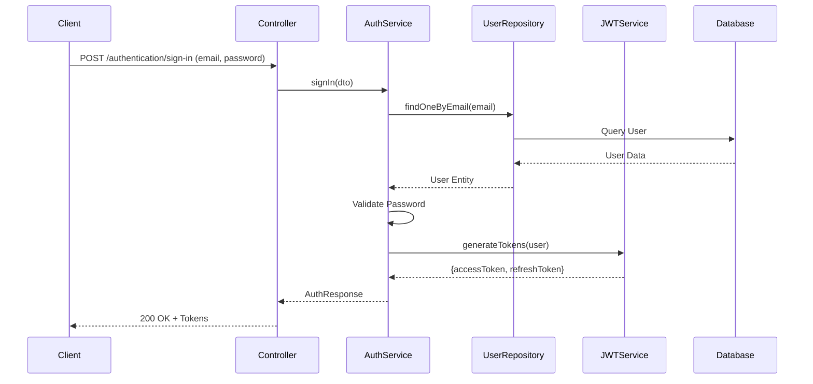
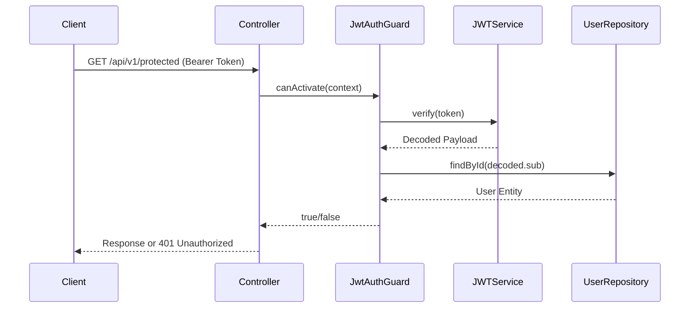
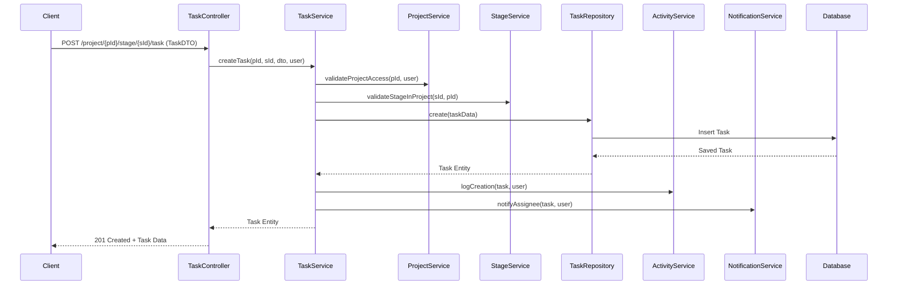
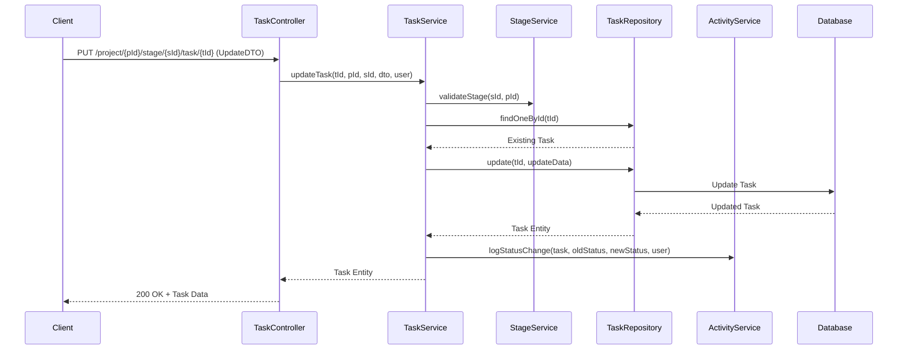
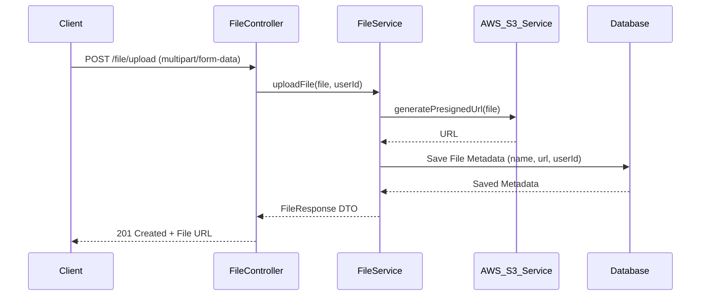
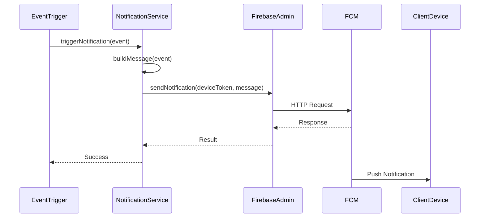
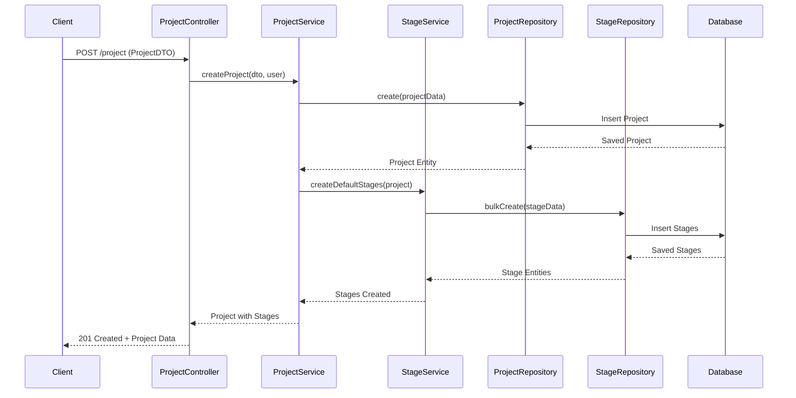
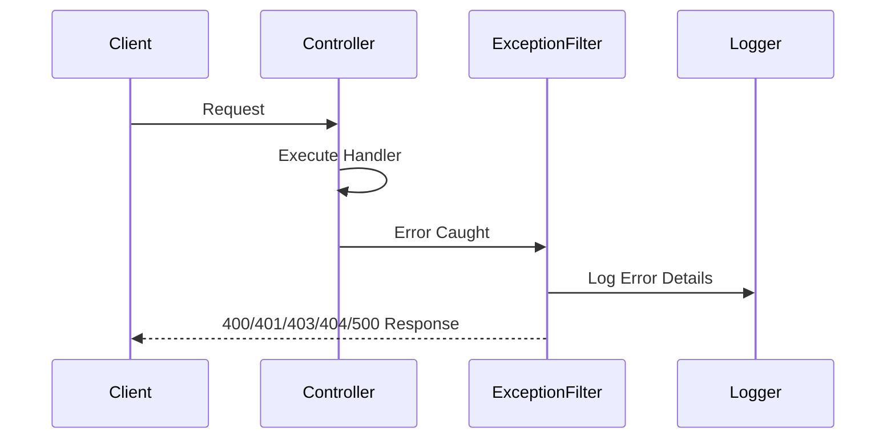

# Flow Diagrams & Data Processes

## 1. Authentication Flow

### 1.1 User Login Sequence

### 1.2 JWT Token Validation Flow

## 2. Task Management Flow

### 2.1 Create Task Sequence

### 2.2 Update Task Status Flow (Kanban Move)

## 3. File Upload Flow

### 3.1 AWS S3 Upload Sequence

## 4. Notification Flow

### 4.1 Real-time Notification via Firebase

## 5. Project & Stage Management Flow

### 5.1 Create Project with Default Stages

## 6. Error Handling Flow

### 6.1 Exception Filter Process

