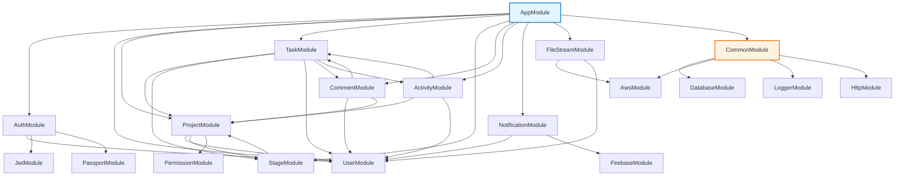

# Module Relationships & Dependencies

## 1. Module Dependency Graph



## 2. Detailed Module Relationships

### 2.1 Auth Module

**Location**: `src/modules/auth/`
**Dependencies**:

- `UserModule` (for user validation)
- `JwtModule` (for token generation)
- `PassportModule` (for authentication strategies)

**Key Components**:

- `AuthService`: Handles login, signup, token refresh
- `AuthController`: API endpoints for authentication
- `JwtStrategy`: Passport strategy for JWT validation
- `RolesGuard`: Authorization guard

### 2.2 User Module

**Location**: `src/modules/user/`
**Dependencies**:

- `Common/Database` (for data access)
- `AuthModule` (for authentication context)

**Key Components**:

- `UserService`: User CRUD operations
- `UserController`: User API endpoints
- `UserEntity`: MongoDB schema

### 2.3 Project Module

**Location**: `src/modules/project/`
**Dependencies**:

- `UserModule` (for owner/createdBy references)
- `StageModule` (for project stages)
- `PermissionModule` (for access control)

**Key Components**:

- `ProjectService`: Project management logic
- `ProjectController`: Project API endpoints
- `ProjectEntity`: MongoDB schema

### 2.4 Task Module

**Location**: `src/modules/task/`
**Dependencies**:

- `ProjectModule` (for project context)
- `StageModule` (for workflow stages)
- `UserModule` (for assignee/reporter)
- `CommentModule` (for task comments)
- `ActivityModule` (for audit trail)

**Key Components**:

- `TaskService`: Task CRUD and workflow logic
- `TaskController`: Task API endpoints
- `TaskEntity`: MongoDB schema with status/priority enums

### 2.5 Stage Module

**Location**: `src/modules/stage/`
**Dependencies**:

- `ProjectModule` (for project association)

**Key Components**:

- `StageService`: Stage management
- `StageController`: Stage API endpoints
- `StageEntity`: MongoDB schema

### 2.6 Comment Module

**Location**: `src/modules/comment/`
**Dependencies**:

- `TaskModule` (for task association)
- `ProjectModule` (for project association)
- `UserModule` (for author reference)

**Key Components**:

- `CommentService`: Comment CRUD operations
- `CommentController`: Comment API endpoints
- `CommentEntity`: MongoDB schema

### 2.7 Activity Module

**Location**: `src/modules/activity/`
**Dependencies**:

- `TaskModule` (for task activities)
- `ProjectModule` (for project activities)
- `UserModule` (for actor reference)

**Key Components**:

- `ActivityService`: Activity logging
- `ActivityController`: Activity API endpoints
- `ActivityEntity`: MongoDB schema

### 2.8 Notification Module

**Location**: `src/modules/notification/`
**Dependencies**:

- `UserModule` (for user device tokens)
- `FirebaseModule` (for push notifications)

**Key Components**:

- `NotificationService`: Notification logic
- `FirebaseService`: Firebase integration
- `NotificationController`: Notification API endpoints

### 2.9 File Stream Module

**Location**: `src/modules/file-stream/`
**Dependencies**:

- `AwsModule` (for S3 integration)
- `UserModule` (for file ownership)

**Key Components**:

- `FileService`: File upload/download logic
- `FileController`: File API endpoints
- `AwsS3Service`: S3 operations

## 3. Cross-Module Communication Patterns

### 3.1 Service-to-Service Communication

```typescript
// Example: TaskService calling ProjectService
constructor(
  private readonly projectService: ProjectService,
  private readonly taskRepository: TaskRepository
) {}

async createTask(projectId: string, dto: CreateTaskDto) {
  const project = await this.projectService.findOne(projectId);
  // ... create task logic
}
```

### 3.2 Event-Based Communication

```typescript
// Example: Using NestJS Events
constructor(private readonly eventEmitter: EventEmitter2) {}

async updateTask(taskId: string, updateData: UpdateTaskDto) {
  const task = await this.taskRepository.update(taskId, updateData);
  this.eventEmitter.emit('task.updated', { task, user: currentUser });
  return task;
}
```

### 3.3 Dependency Injection

All modules use NestJS's dependency injection system to provide services to controllers and other services.

## 4. Module Initialization Order

1. **Common Modules** (Database, Logger, Aws, Http)
2. **User Module** (required by most other modules)
3. **Auth Module** (depends on User)
4. **Project Module** (depends on User)
5. **Stage Module** (depends on Project)
6. **Task Module** (depends on Project, Stage, User)
7. **Comment Module** (depends on Task, Project, User)
8. **Activity Module** (depends on Task, Project, User)
9. **Notification Module** (depends on User)
10. **File Stream Module** (depends on User, Aws)
11. **App Module** (imports all feature modules)

## 5. Shared Kernel

### 5.1 Common Module Structure

```
src/common/
├── database/      # Mongoose configuration
├── aws/           # AWS S3 services
├── logger/        # Winston logging
├── http/          # Interceptors & middleware
└── decorators/    # Custom decorators
```

### 5.2 Shared Interfaces

- `RepositoryAbstract`: Base repository interface
- `PaginationParams`: Standard pagination
- `ApiResponse`: Standard response format

## 6. Testing Dependencies

### 6.1 Mock Dependencies

- `MockUserRepository`: For testing UserModule
- `MockProjectRepository`: For testing ProjectModule
- `MockJwtService`: For testing AuthModule

### 6.2 Integration Testing

Each module has its own integration tests that verify:

- Service logic
- Repository interactions
- Controller endpoints
